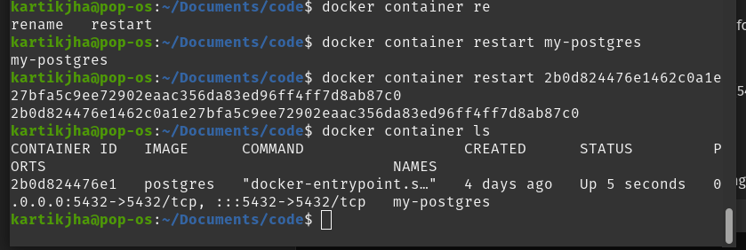
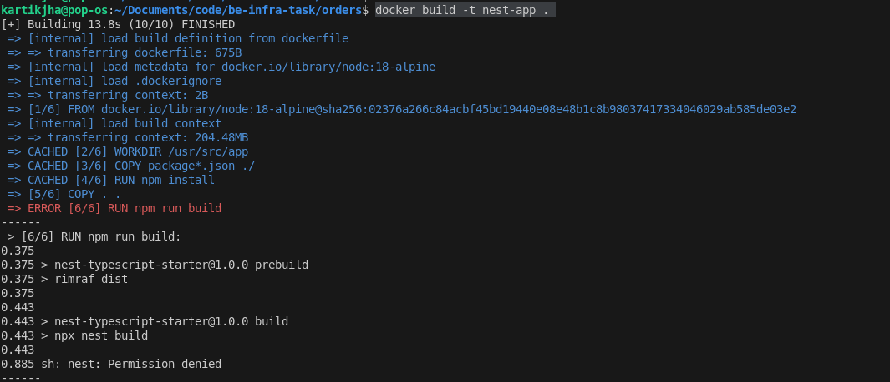

### 3 microservices orders, users, products

### version control architecture

multi-repo design for independent code editing and maintainence

### start PG container and connect to microservices containers 

#### starting PG container 

#### starting microservices

1. orders
    ##### issues encountered

        npm errors

            connectivity error during npm install

                ran npm i in the main environment

                second build fixed the issue

            npm build error `docker build -t nest-app .`

                nest CLI getting permission denied

    